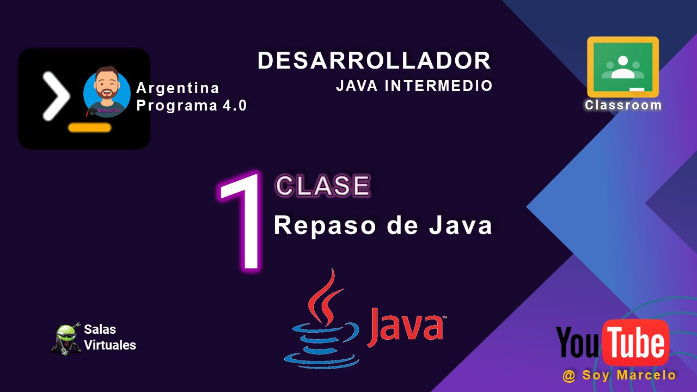
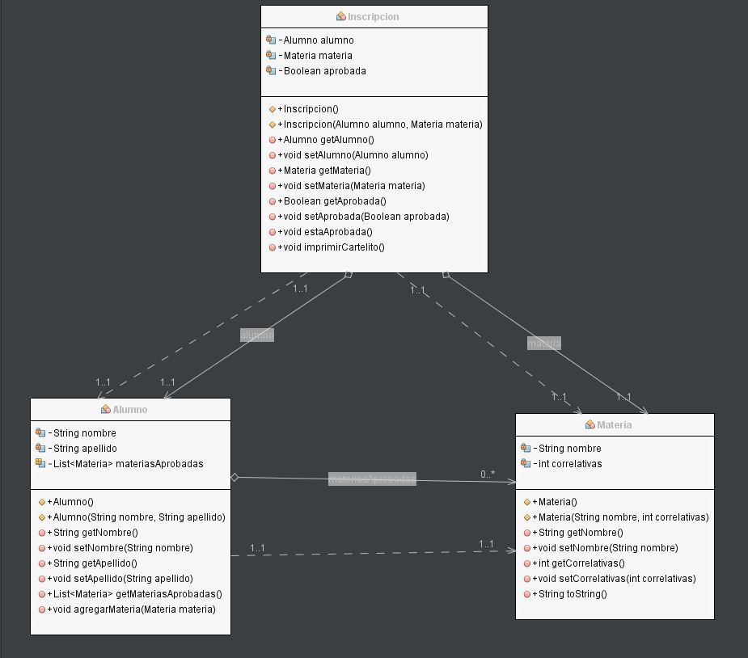

# clase_01
## Repaso Java
[Descarga documento](./recursos/ACT-Clase%201%20-%20Repaso%20Java.pdf)

## Validador de Inscripciones según Correlatividades

Nos han solicitado el diseño y el desarrollo de un Validador de Inscripciones según materias
correlativas.
En las carreras terciarias y universitarias, para ordenar el plan de estudios y asegurar que
cuando se inicia una materia se tienen todos los conocimientos necesarios para entenderla, se
establece lo que se llama comúnmente “materias correlativas”. Básicamente, son materias que
hay que tener aprobadas antes de cursar la materia en cuestión. Por ejemplo, antes de cursar
Diseño de Sistemas hay que cursar Paradigmas de Programación y antes de ésta hay que
cursar Algoritmos y Estructuras de Datos, donde esta última no tiene correlativas.
Teniendo en cuenta que el método principal del presente módulo debe ser el método
“boolean aprobada( )” de la clase Inscripción, y teniendo como restricción que solamente se
podrán utilizar, además de la clase Inscripción, la clase Materia y Alumno; se pide:
* Diseñar una solución en el Paradigma Orientado a Objetos y comunicar la solución
mediante un Diagrama de Clases.
* Codificar la solución (lenguaje a elección o pseudo-código)

